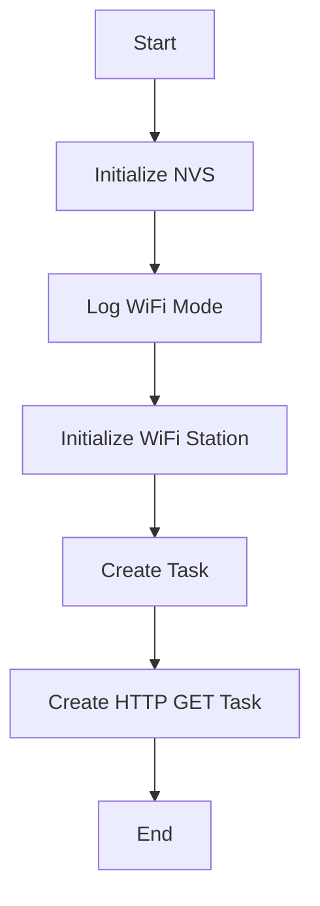
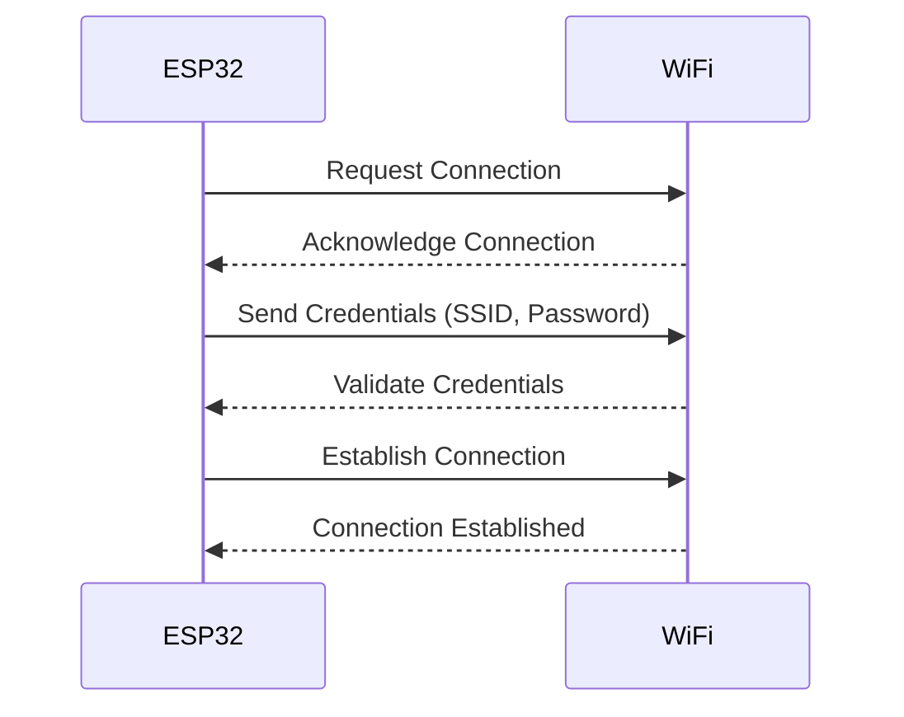

| Supported Targets | ESP32 | ESP32-C2 | ESP32-C3 | ESP32-S2 | ESP32-S3 |
| ----------------- | ----- | -------- | -------- | -------- | -------- |

# _Sample project_

(See the README.md file in the upper level 'examples' directory for more information about examples.)

This is the simplest buildable example. The example is used by command `idf.py create-project`
that copies the project to user specified path and set it's name. For more information follow the [docs page](https://docs.espressif.com/projects/esp-idf/en/latest/api-guides/build-system.html#start-a-new-project)


## How to use example
We encourage the users to use the example as a template for the new projects.
A recommended way is to follow the instructions on a [docs page](https://docs.espressif.com/projects/esp-idf/en/latest/api-guides/build-system.html#start-a-new-project).

Before running the program, you need to set the `WIFI_SSID` and `WIFI_PASSWORD` environment variables. You can do this in the terminal with the following commands:
```bash
export WIFI_SSID=your_wifi_ssid
export WIFI_PASSWORD=your_wifi_password
```
Replace `your_wifi_ssid` and `your_wifi_password` with your actual WiFi SSID and password.

## Main Flow of the Program
Here is a mermaid diagram to illustrate the main flow of the program:



## WiFi and ESP32 Connection Sequence

Here is a mermaid sequence diagram to illustrate how the connection is established between the WiFi and the ESP32 device:



## Example folder contents

The project **sample_project** contains one source file in C language [main.c](main/main.c). The file is located in folder [main](main).

ESP-IDF projects are built using CMake. The project build configuration is contained in `CMakeLists.txt`
files that provide set of directives and instructions describing the project's source files and targets
(executable, library, or both). 

Below is short explanation of remaining files in the project folder.

```
├── CMakeLists.txt
├── main
│   ├── CMakeLists.txt
│   └── main.c
└── README.md                  This is the file you are currently reading