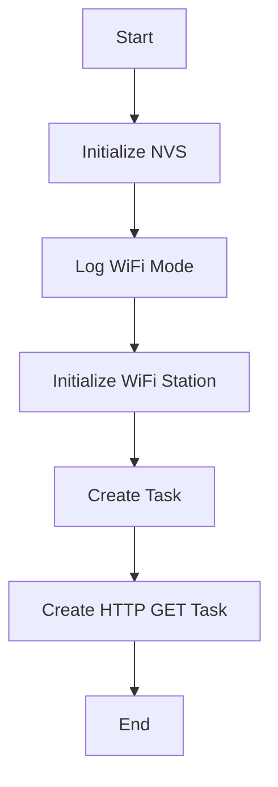
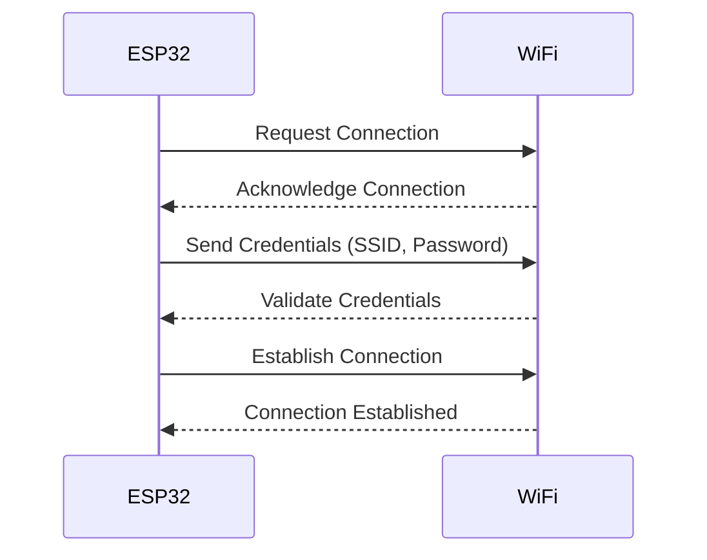

| Supported Targets | ESP32 | ESP32-C2 | ESP32-C3 | ESP32-S2 | ESP32-S3 |
| ----------------- | ----- | -------- | -------- | -------- | -------- |

# OTA Project

This project demonstrates how to perform Over-The-Air (OTA) updates on an ESP32 device. The main application code is in `main/main.c`, which includes WiFi initialization, HTTP client setup, and OTA update functionality.

## Project Description

The project is designed to connect to a WiFi network, download a firmware update from a specified URL, and apply the update to the ESP32 device. The update process is secured using HTTPS and a server certificate.

## Setup Instructions

1. Clone the repository:
```bash
git clone https://github.com/hazem3443/OTA.git
cd OTA
```

2. Set up the development environment:
   - Ensure you have Docker installed.
   - Build the Docker container:
     ```bash
     docker build -t esp-idf .
     ```
   - Start the Docker container:
     ```bash
     docker run -it --rm -v $(pwd):/project esp-idf
     ```

3. Configure the project:
   - Open the project in Visual Studio Code.
   - Install the recommended extensions listed in `.devcontainer/devcontainer.json`.
   - Configure the `.vscode/settings.json` file with your development environment settings.

4. Set the WiFi credentials:
   - Open `main/main.c` and update the `ssid` and `password` fields with your WiFi network credentials.

5. Build and flash the project:
   ```bash
   idf.py build
   idf.py flash
   ```

## Usage Examples

1. Connect the ESP32 device to your computer via USB.
2. Open a serial monitor to view the device logs:
   ```bash
   idf.py monitor
   ```
3. The device will connect to the WiFi network and check for firmware updates.
4. If an update is available, the device will download and apply the update automatically.

## Firmware.json

The `Firmware.json` file is used to specify the firmware version and the URL of the binary file for OTA updates. The file should be hosted on a server and accessible via HTTPS. The format of the `Firmware.json` file is as follows:
```json
{
  "version": 1.20231008005,
  "binfile": "https://raw.githubusercontent.com/hazem3443/OTA/master/build/OTA.bin"
}
```
- `version`: The version number of the firmware.
- `binfile`: The URL of the binary file to be downloaded and applied.

## Sweep.yaml

The `sweep.yaml` file is used to configure Sweep AI for automated bug fixes and feature requests. Sweep AI reads the logs and outputs from your existing GitHub Actions to create pull requests for bug fixes and new features. The configuration options include:
- `branch`: The branch to which Sweep AI will create pull requests.
- `gha_enabled`: Whether to enable GitHub Actions integration.
- `description`: A description of your project for Sweep AI.

## Configuration Files

- `.devcontainer/devcontainer.json`: Configuration file for setting up the development environment using Docker and Visual Studio Code.
- `.vscode/settings.json`: Configuration file for Visual Studio Code settings, including paths to ESP-IDF tools and extensions.

## Main Flow of the Program
Here is a mermaid diagram to illustrate the main flow of the program:



## WiFi and ESP32 Connection Sequence

Here is a mermaid sequence diagram to illustrate how the connection is established between the WiFi and the ESP32 device:



## Example folder contents

The project **sample_project** contains one source file in C language [main.c](main/main.c). The file is located in folder [main](main).

ESP-IDF projects are built using CMake. The project build configuration is contained in `CMakeLists.txt`
files that provide set of directives and instructions describing the project's source files and targets
(executable, library, or both). 

Below is short explanation of remaining files in the project folder.

```
├── CMakeLists.txt
├── main
│   ├── CMakeLists.txt
│   └── main.c
└── README.md                  This is the file you are currently reading
```
